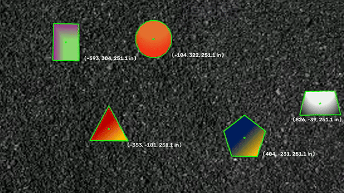
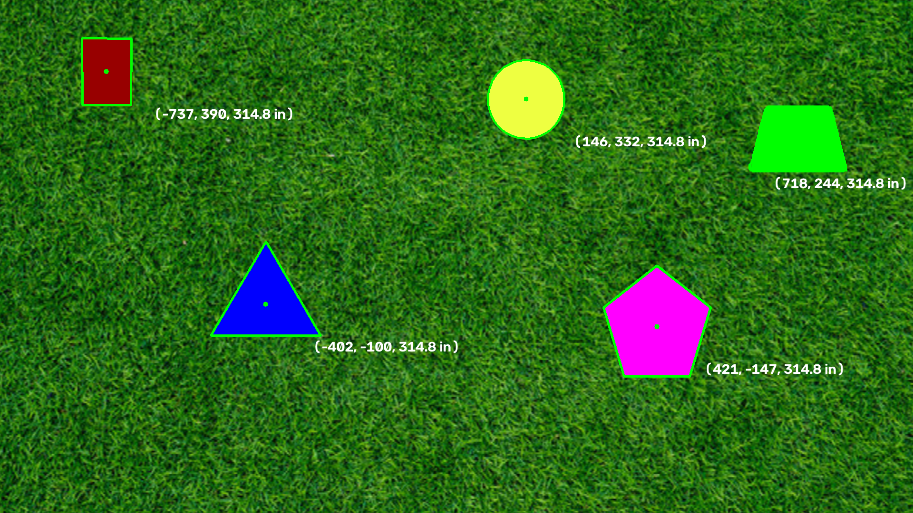
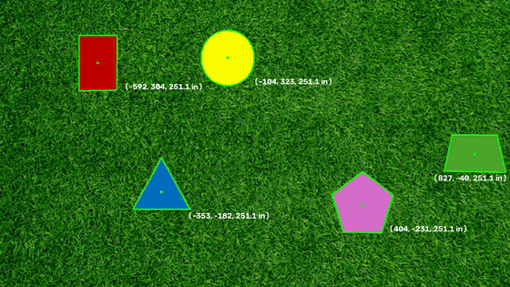

# PennAiR Software Challenge

Solution to the PennAiR software challenge: detecting solid shapes on textured backgrounds, tracking them through video, extending the algorithm to be background agnostic, recovering their 3D positions from camera intrinsics, and wrapping the whole pipeline in ROS2 nodes.

Everything is built from classical computer vision techniques (OpenCV filtering, morphology, and contour analysis) implemented into an original algorithm.
No pretrained models and no end-to-end learned solutions are used.



## Results

| Deliverable | File |
|---|---|
| Part 1: processed static image | [results/static_image.png](results/static_image.png) |
| Part 2: processed video (grass background) | [results/video_solid_background.mp4](results/video_solid_background.mp4) |
| Part 3: processed video (background agnostic) | [results/video_background_agnostic.mp4](results/video_background_agnostic.mp4) |
| Part 4: 3D positions | overlaid as `(x, y, Z in)` labels in both videos above |
| Part 5: ROS2 system | `ros2_ws/` (see [Part 5](#part-5-ros2)) |

The GIFs embedded in this README are compressed previews.
The `results/` folder holds the full-quality processed videos.

## How to run

### Standalone (Parts 1 to 4)

Requirements: Python 3 with `opencv-python` and `numpy`, plus `ffmpeg` on the PATH for the final H.264 encode.

The input media is not committed (the source videos exceed GitHub's file size limit).
Place the challenge files in `media/` as `testimage.png`, `videotest.mp4`, and `hardvideotest.mp4`.

```sh
python3 main.py
```

This opens a live window and writes the annotated video to `media/output.mp4`.
`VIDEO_PATH` at the top of `main.py` selects the input video.

### ROS2 (Part 5)

One-time setup on macOS through [RoboStack](https://robostack.github.io/) (ROS2 has no official macOS binaries). I could've worked on an Ubuntu virtual machine but I found this setup to be more suitable for my development preferences:

```sh
brew install micromamba
micromamba shell init --shell zsh --root-prefix ~/mamba   # then open a new terminal
micromamba create -n ros2 -c conda-forge -c robostack-jazzy \
    ros-jazzy-desktop ros-jazzy-cv-bridge ros-jazzy-rqt-image-view colcon-common-extensions rosdep
micromamba env config vars set -n ros2 RMW_IMPLEMENTATION=rmw_cyclonedds_cpp
micromamba activate ros2
cd ros2_ws && colcon build --symlink-install
```

After that, everything runs through one script:

```sh
./run.sh                       # start the pipeline: video stream + shape detection
./run.sh echo                  # 2nd terminal: readable detections table
./run.sh view                  # 3rd terminal: annotated video window
./run.sh raw                   # raw /detections messages (YAML)
./run.sh media/videotest.mp4   # run on a different video
```

## Part 1: shape detection on a static image

**Task**: find the solid shapes on the grass image and trace their outlines and centers.

**Approach**: the key observation is that the background dominates the frame, and each pixel can be scored by how much it deviates from it.

1. A large median blur (21 px) flattens the grass texture while solid shapes keep their color and edges.
2. The image-wide median color is taken as the background color, and each pixel gets a distance from it.
3.  `median + 8 * MAD` provides a dynamic threshold for the distance image.
4. A morphological opening removes speckle, and contours with an area filter give the final shapes.

**Challenges**: a fixed color threshold worked on one image but was fragile.
Switching to robust statistics (median and MAD instead of mean and standard deviation, which the shapes themselves would skew) made the threshold self-calibrating.



## Part 2: shape detection on video

**Task**: run the detection on every frame of the video and mark each shape's center, treating the video as a live stream (no peeking ahead).

**Approach**: the Part 1 algorithm was refactored into a `detect_shapes(frame)` function applied frame by frame.
The background model is recomputed per frame, so the cut adapts to lighting changes as the camera moves.
Centers come from contour moments (`m10/m00`, `m01/m00`).

**Challenges**: mostly video plumbing rather than vision.
OpenCV's H.264 writer produces corrupt streams on this platform, so frames are written as an mp4v intermediate and re-encoded with ffmpeg.
To meet the 60 fps output requirement from a ~30 fps source at the correct playback speed, each frame is written twice and the file is stamped at double the source rate.

Result: [results/video_solid_background.mp4](results/video_solid_background.mp4)



## Part 3: background agnostic detection

**Task**: make the algorithm work on any background, demonstrated on the hard video.

The core challenge here revolved around the fact backgrounds were no longer one color, and some shapes are shaded with gradients that locally match the background color.
The final algorithm keeps the same core idea (model the background, flag what deviates) but strengthens every stage:

1. **Robust color model in Lab space**: the median-blurred frame is converted to Lab, and the background is modeled per channel by median and MAD.
Through some trial and error I found lowering MAD to 2.0 worked quite better on the current system.
2. **Coarse mask**: pixels whose distance exceeds `k = 5` form a first mask, cleaned by morphological opening and closing.
3. **Texture cue**: solid shapes are smooth while background is textured.
Laplacian energy measures local texture, and smooth regions adjacent to coarse detections are merged in.
This recovers gradient-shaded shape interiors that match the background color but are far too smooth to be background.
4. **Hole filling and speck removal**: flood fill from the border closes internal holes, and connected-component analysis drops small blobs.
5. **Edge refinement**: the median blur that stabilizes the color model also smears edges by ~10 px.
A second pass re-decides a 7 px band around each region from lightly blurred raw pixels, comparing each pixel's distance to the shape's own mean color against its distance to the background model. This change increased accuracy significantly as it aligned edges with actual figure edges in the video. 
6. **Polygonization**: the raw mask contour wobbles, so each shape is snapped to a clean polygon.
`approxPolyDP` proposes vertices, a line is fit to each edge of the outline, and the 3, 4, or 5 longest sides are extended and intersected.
The candidate polygon is accepted only if it is convex.

**Challenges**: the gradient-shaded shapes were the hardest case, since by color alone they *are* background.
The texture cue solved that.

The second hardest was edge precision, solved by the two-stage decide-coarsely-then-refine-the-band structure.

Result: [results/video_background_agnostic.mp4](results/video_background_agnostic.mp4)


## Part 4: 3D positions from camera intrinsics

**Task**: using the provided camera intrinsics and the fact that the circle has a 10 inch radius, compute each shape's 3D position in camera coordinates.

**Approach**: the intrinsic matrix has its principal point at (0, 0), so pixel coordinates are measured from the frame center (x right, y up).

1. The circle is the only shape of known physical size, so it anchors the depth: `Z = fx * 10 / r_px`, where `r_px` is the circle's pixel radius recovered from its contour area.
2. All shapes lie on the same flat surface, so they share that depth.
3. Each center back-projects to 3D as `P = Z * K^-1 * [x, y, 1]`.

**Challenges**: when the circle is clipped by the frame border its apparent area shrinks, which would inflate the depth estimate.
Border-touching circles are therefore rejected as depth anchors, and the last good depth is carried until the circle is fully visible again.
With that in place the estimated depth stays in a tight 251.0 to 251.1 inch band across both videos, which matches the fixed camera height of the recordings.

The `(x, y, Z)` labels in both result videos come from this stage.

## Part 5: ROS2

**Task**: stream the video as ROS2 image messages, run the detector as a node, publish detections (positions and outlines) on a topic, and provide a launch file.

The workspace `ros2_ws/` contains two packages:

**`pennair_vision`** (nodes):

| Node | Subscribes | Publishes |
|---|---|---|
| `video_publisher` | - | `camera/image_raw` at the video's own ~30 fps |
| `shape_detector` | `camera/image_raw` | `detections` (positions + outlines) and `detections/image` (annotated frames) |
| `detections_echo` | `detections` | - (prints a human-readable table) |

`pennair_vision/detection.py` is the algorithm from `main.py` without the video I/O, kept in sync mechanically.

**`pennair_vision_msgs`** (interface): custom messages, since detections do not fit any standard type.

```
ShapeArray: std_msgs/Header + Shape[]
Shape:      x, y (px from frame center), depth (in), position (geometry_msgs/Point, inches),
            is_circle, outline (geometry_msgs/Polygon, image pixels)
```

`pennair.launch.py` starts the publisher and detector together with the video path as a launch argument, and `run.sh` wraps environment activation, workspace sourcing, and the launch invocation into one command.

| Topic | Type | Content |
|---|---|---|
| `camera/image_raw` | `sensor_msgs/Image` | the video stream, ~30 fps |
| `detections` | `pennair_vision_msgs/ShapeArray` | per shape: centered pixel centroid, depth (in), 3D position (in), is_circle, outline polygon |
| `detections/image` | `sensor_msgs/Image` | annotated frames |

1. **Half-resolution segmentation**: every stage of the algorithm costs proportionally to pixel count, so segmentation runs on a 2x downscaled frame (4x fewer pixels) and the contours are scaled back up to full resolution.
Per-frame cost dropped from 195 ms to 48 ms.
2. **Newest-frame subscription (queue depth 1)**: the detector is still slower than the 30 fps stream, so instead of queueing frames and accumulating latency, it always processes the newest frame and drops the rest.

Measured live over 30 seconds: detections publish at 12.9 Hz with a median capture-to-detection latency of 242 ms, down from 4.6 Hz and roughly 650 ms before the optimization.

## Repository structure

```
main.py                  standalone pipeline: Parts 1 to 4 (detection, tracking, polygons, 3D)
run.sh                   one-command runner for the ROS2 system
results/                 processed image and videos (the deliverables)
media/                   input videos (not committed, see How to run)
ros2_ws/src/
  pennair_vision/        video_publisher, shape_detector, detections_echo nodes + launch file
  pennair_vision_msgs/   Shape and ShapeArray message definitions
```

## Development notes

- After editing node code, no rebuild is needed (`--symlink-install`).
After editing messages or adding files, rebuild with `colcon build --symlink-install` in `ros2_ws`.
- The work was done part by part on branches `part-1` through `part-5`, each merged through a pull request; the commit history documents the progression.
